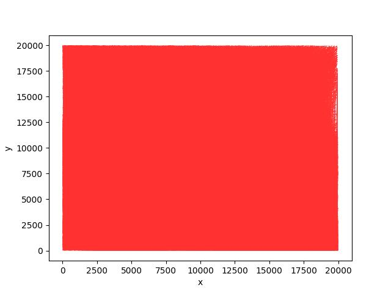
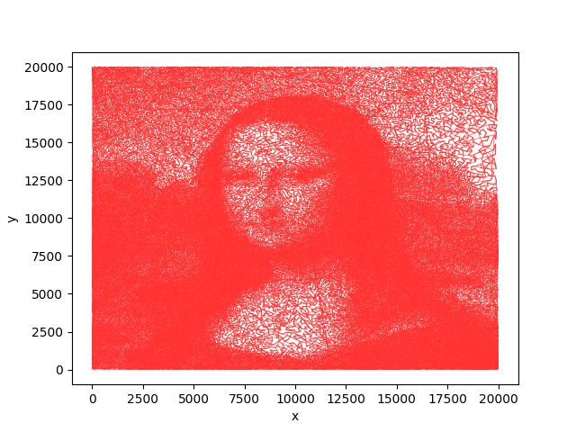
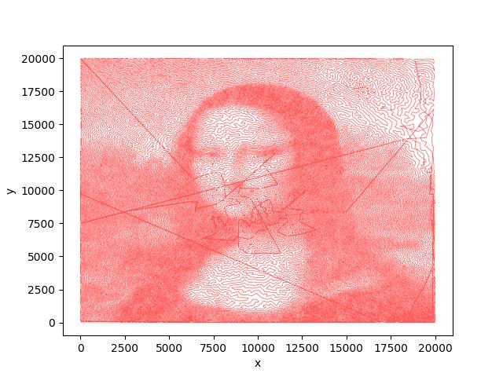
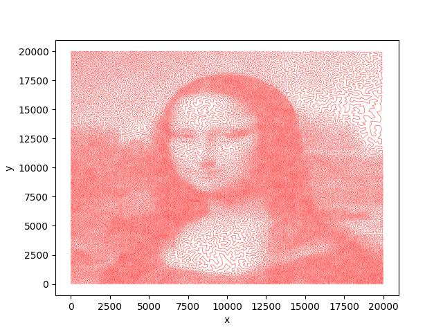

# An attempt to the Mona Lisa TSP problem
---
# Introduction

The original problem lies in the link：[MonaLisaTSP](https://www.math.uwaterloo.ca/tsp/data/ml/monalisa.html)

And you can download the node information from here：[mona-lisa100K.tsp](https://www.math.uwaterloo.ca/tsp/data/ml/mona-lisa100K.tsp)

**!!!Note!!!**:All the paths in the code are absolute. If you want to use the code, either replace it with the corresponding absolute path or change it to a relative path according to your environment

---
# Approches
## Distance Matrix Calculation
The numpy files of distance matrixes, which are approximately 75GB, are too large to upload to github. So, if you wanna use this repository, you need to calculate and store these distance matrixes locally.
```
# Euclidean Distance
bash scripts/dist_matrix_cal.sh
# Manhattan Distance
bash scripts/dist_matrix_cal_manhatan.sh
```
## GA Algorithm
The GA algorithm performs bad. I didn't take it's results. 
```
bash scripts/ga_optimize.sh
```
The results of GA algorithm are shown below. The first image is inited randomly, and the second image is inited by searching the nearest node.The second path length is 8987638.4.


(In fact, when you init greedily, the ga algorithm can't optimize any more after initialization.)

## A* Search
```
bash scripts/astar_one_way_avg_optimize_manhatan.sh 20
```
There are two heuristic functions for A * search: one is the sum of the distance from the node to the farthest unvisited node and the distance from the farthest unvisited node to the starting node, and the other is the average distance from the node to the unvisited node to be calculated. After verification, the second method has a better effect.
The result of A* search is shown below. The path length is 6313938.200223035.


## Post Process
For existing results, first calculate the mean and variance of all line segment lengths. The endpoints of line segments with lengths outside three times the variance are considered outliers. For all outlier points, try to swap the order with points within a certain threshold around yourself. If possible, keep the length shorter to optimize the path. The Final Path Length is 6303257.088980756.
```
bash scripts/post_process_all_round.sh
bash scripts/post_process_fast.sh
```


---
## LKH Solver
I also used a solver called LKH. This solver can be downloaded from this [repository](https://github.com/ntnu-arl/LKH_TSP). 
```
bash scripts/lkh.sh
```
The effect of the solver is as follows. The path length is 5758700.

